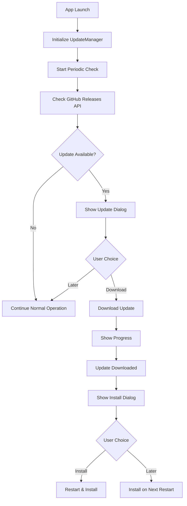

# Maraikka Update System

## Overview

The Maraikka application implements a comprehensive dual-distribution update system that supports both GitHub releases (direct distribution) and Mac App Store distribution, each with their own update mechanisms.

## Architecture

### Core Components

1. **UpdateManager** (`src/updater.js`)
   - Handles auto-update logic for GitHub releases
   - Manages update checking, downloading, and installation
   - Provides App Store update guidance
   - Integrates with `electron-updater`

2. **Version Manager** (`scripts/version-manager.js`)
   - CLI tool for version management
   - Handles distribution-specific versioning
   - Synchronizes versions between GitHub and App Store builds

3. **GitHub Actions Workflow** (`.github/workflows/release.yml`)
   - Automated build and release pipeline
   - Handles code signing and notarization
   - Creates releases for both distributions

4. **UI Components**
   - Update notifications in main renderer
   - Progress indicators for downloads
   - User-friendly update dialogs

## Distribution Strategy

### GitHub Releases (Direct Distribution)
- **Target**: Power users, developers, beta testers
- **Update Method**: `electron-updater` with automatic checking
- **Versioning**: Semantic versioning (v1.2.3)
- **Benefits**: 
  - Immediate releases
  - Beta/alpha versions
  - Faster update cycle
  - More control over features

### Mac App Store Distribution
- **Target**: General consumers, enterprise users
- **Update Method**: Apple's App Store update system
- **Versioning**: App Store format (1.2.3 + build number)
- **Benefits**:
  - Built-in user trust
  - Automatic updates through system
  - Sandboxed security
  - App Store discoverability

## Technical Implementation

### Auto-Update Flow (GitHub)



### Version Management

```javascript
// GitHub Release Configuration
{
  "version": "1.2.3",
  "appId": "com.maraikka.app",
  "publish": {
    "provider": "github",
    "owner": "maraikka-labs",
    "repo": "maraikka-app"
  }
}

// Mac App Store Configuration
{
  "version": "1.2.3",
  "buildNumber": "202412151430", // Timestamp-based
  "appId": "com.maraikka.app.store",
  "mas": {
    "entitlements": "assets/entitlements.mas.plist",
    "category": "public.app-category.utilities"
  }
}
```

### Update Notification System

The UI provides real-time feedback for update operations:

- **Update Available**: Shows version info and download option
- **Download Progress**: Real-time progress bar with percentage
- **Update Ready**: Prompts for restart and installation
- **Error Handling**: User-friendly error messages

## Security Considerations

### Code Signing
- All GitHub releases are signed with Developer ID certificates
- Mac App Store builds use App Store certificates
- Automatic notarization for macOS Gatekeeper

### Update Security
- HTTPS-only update channels
- Signature verification for downloaded updates
- Rollback capability for failed updates

### Sandboxing
- App Store builds run in Apple's sandbox
- GitHub builds have more system access
- Appropriate entitlements for each distribution

## Usage

### For Developers

#### Release a New Version
```bash
# Bump version for GitHub release
node scripts/version-manager.js bump patch github

# Create and push tag
git tag v1.2.3
git push origin v1.2.3

# GitHub Actions will automatically build and release
```

#### Manual Build
```bash
# Build for GitHub distribution
npm run build:github

# Build for Mac App Store
npm run build:mas

# Publish to GitHub
npm run publish:github
```

#### Version Management
```bash
# Check current version
node scripts/version-manager.js current

# Sync versions between distributions
node scripts/version-manager.js sync

# Validate configuration
node scripts/version-manager.js validate
```

### For Users

#### GitHub Release Users
- Automatic update checks every 4 hours
- Manual check via application menu
- Download and install prompts
- Background downloads with progress

#### App Store Users
- Updates through Mac App Store
- System notifications for updates
- Automatic or manual installation
- No additional configuration needed

## Configuration

### Environment Variables
```bash
# Required for code signing
export APPLE_ID="your-apple-id@example.com"
export APPLE_APP_SPECIFIC_PASSWORD="app-specific-password"
export APPLE_TEAM_ID="your-team-id"
export CSC_LINK="path-to-certificate.p12"
export CSC_KEY_PASSWORD="certificate-password"

# Distribution type
export DISTRIBUTION="github" # or "appstore"
```

### Update Settings
```javascript
// Update check frequency (4 hours)
const UPDATE_CHECK_INTERVAL = 4 * 60 * 60 * 1000;

// Auto-download updates
autoUpdater.autoDownload = false;

// Install on app quit
autoUpdater.autoInstallOnAppQuit = true;
```

## Monitoring and Analytics

### Update Metrics
- Update adoption rates
- Download success/failure rates
- User update preferences
- Distribution channel performance

### Error Tracking
- Update check failures
- Download interruptions
- Installation errors
- Network connectivity issues

## Troubleshooting

### Common Issues

#### Update Check Failures
```bash
# Check network connectivity
curl -I https://api.github.com/repos/maraikka-labs/maraikka-app/releases/latest

# Verify certificates
security find-identity -v -p codesigning
```

#### Build Issues
```bash
# Clean build environment
rm -rf dist/ node_modules/
npm install
npm run build
```

#### Code Signing Problems
```bash
# Check certificate validity
security find-identity -v -p codesigning

# Verify notarization status
xcrun altool --notarization-history 0 \
  --username "$APPLE_ID" \
  --password "$APPLE_APP_SPECIFIC_PASSWORD"
```

### Debug Mode
```bash
# Enable debug logging
DEBUG=electron-updater npm start

# Check application logs
tail -f ~/Library/Logs/Maraikka/main.log
```

## Future Enhancements

### Planned Features
- Delta updates for faster downloads
- Update rollback mechanism
- A/B testing for updates
- Update scheduling options
- Offline update support

### Distribution Expansion
- Windows Store support
- Linux package managers
- Enterprise deployment options
- Custom update servers

## Best Practices

### Release Management
1. Always test updates in development
2. Use semantic versioning consistently
3. Provide clear release notes
4. Monitor update adoption rates
5. Have rollback plans ready

### Security
1. Keep certificates up to date
2. Use secure update channels
3. Verify update signatures
4. Monitor for security issues
5. Respond quickly to vulnerabilities

### User Experience
1. Minimize update interruptions
2. Provide clear progress feedback
3. Allow user control over updates
4. Communicate changes clearly
5. Test across different scenarios

---

This update system provides a robust, secure, and user-friendly way to keep Maraikka applications current across multiple distribution channels while maintaining the flexibility to serve different user needs. 